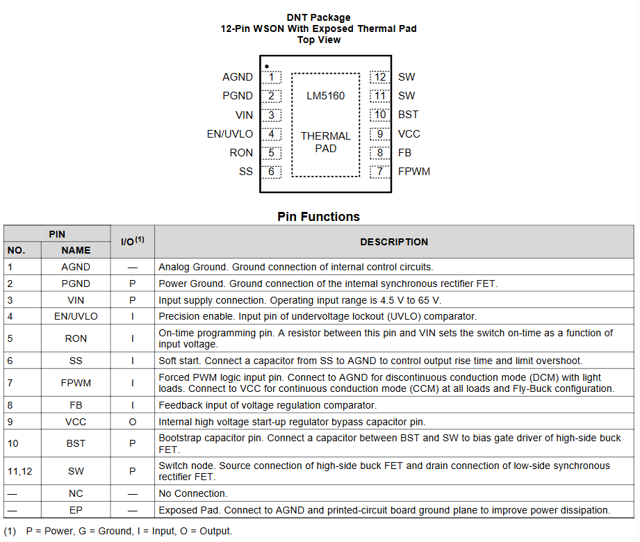

# BUCKs converter

We are going to use the LM5160 fammily. This are justification of the engineering decisions based on the `resources\datasheets\BUCK CONVERTER\TI - LM5160X.pdf` datasheet.

Technical Briefs on design choices are available at the following location:
- [Soft Start Capacitor](details/BUCK/soft_start.md)
- [Switching Frequency - $R_{on}$](details/BUCK/switching_freq.md)
- [Ripple Generation](details/BUCK/ripple_generation.md)
- [Selection of the inductor](details/BUCK/selection_inductor.md)
- [Other choices](details/BUCK/other_choices.md)

Following is the pinout of the IC:

