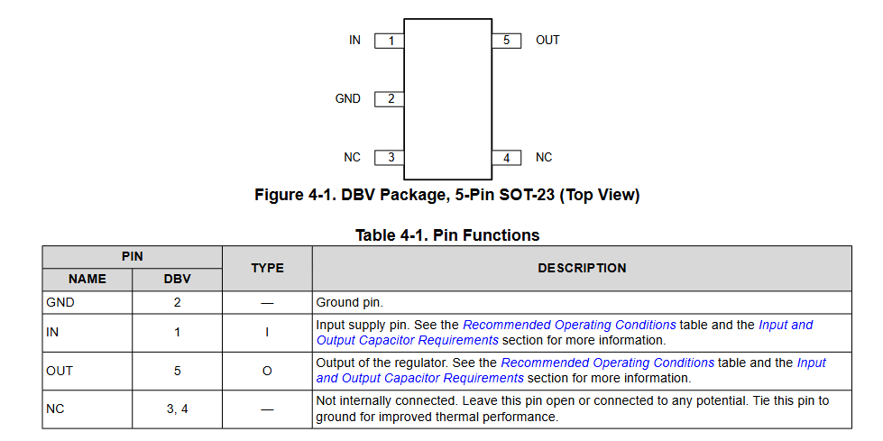
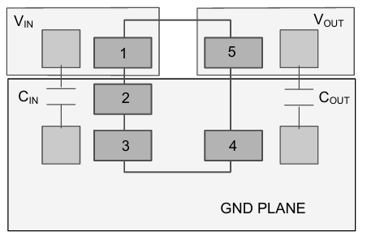
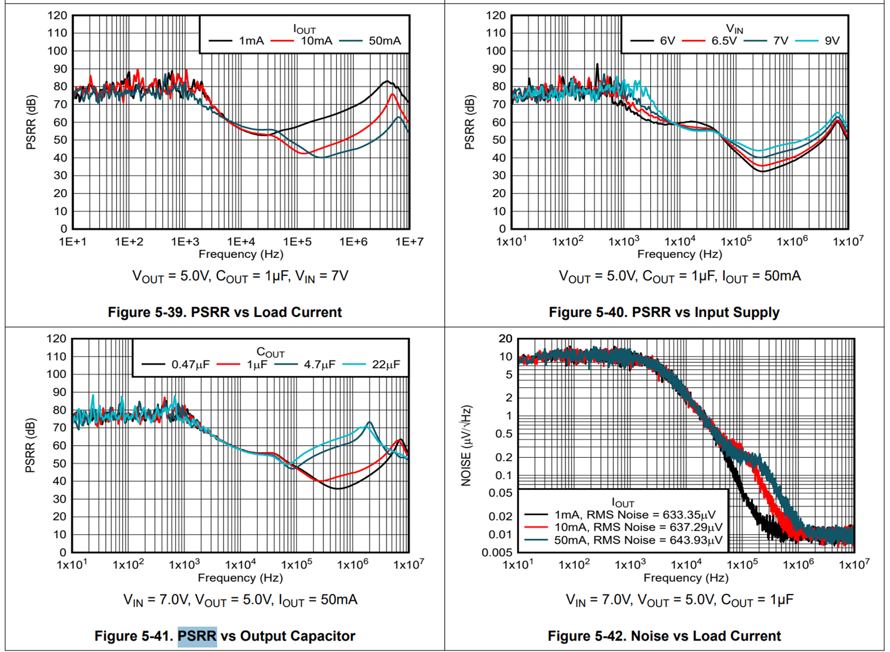

# LDO

The LDO is used to power the STM32G484. It will be powered by the 10V BUCK, hence no additionnal protection from battery spikes is required. However, the LDO input will have to handle the buck ripple and transient caused by the gate driver, that we estimed to be between 10kHz-100kHz. Moreother, the higher the Power Supply Rejection Ratio (PSRR), better the filtering of the noise. Hence, I chosed to go with the Texas Instrument TPS7B92, which, in addition to have a good PSRR, is well documented. It is rated for 300mA@3.3V, which should be enough for the MCU and some leds. However, its dropout voltage is quite hight, 1V@100mA to 3V@300mA, dissipating (10-3.3)*0.3=2W in heat. With this choice I sacrified heat for stability, which I don't think is a great choice for a digital supply. However, because my ADC sampling will be done in the MCU, this ensure, at least, a good AVcc if well used.

## Technical Brief: Components selection.

These graphs, extracted from the database, illustrate the impact of different parameters on the PSRR. We will use a COUT=4.7µF as it balance size and performance.

The datasheet recommend to use a TVS diode in case we expect negative currents to flow in the device. However, as 10V>>3.3V, we do not expect any negative current. AS such, we wont add a TVS diode.

