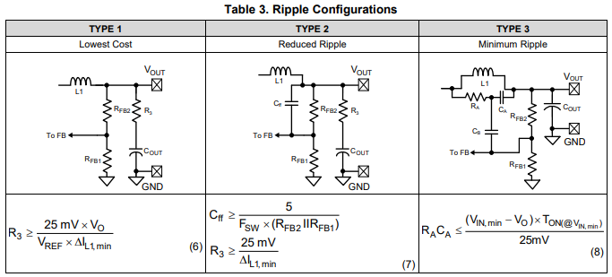

# Other choices

Following are listed some other engineering choices for the buck converter layout.

## Technical Brief: Generation of ripple

This design does not rely on a clock (COT - Constant-On Time), instead it wait for the output voltage to drop under a given Vref during buck off time, then fire for a given amout of time (T_on). This allows the tension output to be contant and not dependant of Vin. However, this as 2 major drawbacks:

1. A reference voltage V_ref must be defined so the comparators can work. This is done internally in the IC.
2. The ripple magnitude must be an order of magnitude more important than the one of the noise so they can be distinguished: highly filtered systems (low ESR/MLCC heavy) may not be generate enough ripple.

We estimeed that design one would be sufficient in our case.

_Note1_: Point 2 must be looked at on the final system, as we may have issue with ripple amplitude.

## Technical Brief: Forced PWM (FPWM)

If FPWM is put to low, then the efficiency is increased. The low side mostfet behave as a diode and some commutation steps can be skip if low cuurent is required. However, this create some noise and less predictable behavior overall as steps can be skipped. Thus we will force CCM by putting FPWM to high.

## Technical Brief: Selection of the Collector Voltage $V_{CC}$

As the $V_{out}$ voltage is 10V, $V_{cc}$ could be powered using $V_{out}$ to gain efficiency and limit termal losses inside the chip (with the LM5160A chip). It is not implemented as it adds layout complexity for a gain we deemed minimal.

## Technical Brief: Selection of the Feedback Resitors $R_{FB1} \text{ and } R_{FB2}$

$V_{OUT} = \frac{V_{REF} \times (R_{FB1} + R_{FB2})}{R_{FB1}}$, specified in the datasheet.

Where $V_{REF} = 2V$. We want $V_{OUT} = 10V$ so $\frac{R_{FB2}}{R_{FB1}} = 4$. We should try to keep the sum (lost power), in the $10k\Omega \text{ to } 100k\Omega$ order.

## Technical Brief: Selection of the Current Limit Timer $C_{VCC}$

It is recommended to have $C_{VCC} = 1\mu F$, good quality X7R.

## Technical Brief: Selection of the Current Limit Timer $C_{BST}$

Soft start is important to limit current flow at ESC start as all capactior will require to be chatge simultaneously. If well control, it could even be used to reduce the resistance of the boostrap capacitor of the gate driver so we can charge it faster during normal operation.

It is recommended to have $C_{BST} = 10nF$, with a good quality X7R. It is fed by $C_{VCC}$ during off times.

## Technical Brief: Selection of the Current Limit Timer $T_{off(CL)}$

This compute the delay if too much current is draw from the IC output (2.5A)

$T_{\text{OFF(CL)}} =
\frac{5\,V_{\text{IN}}}{24\,V_{\text{FB}} + 12}\;\mu\text{s}$